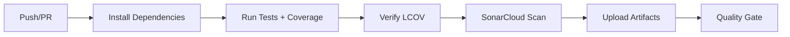

# 🔧 Configuración de SonarCloud para fluffy-deals-hub

## 📋 Prerrequisitos

1. Cuenta en [SonarCloud](https://sonarcloud.io/)
2. Repositorio en GitHub: `eospgonz10/fluffy-deals-hub`
3. Permisos de administrador en el repositorio

---

## 🚀 Pasos de Configuración

### 1️⃣ Configurar SonarCloud

#### A. Crear/Importar Proyecto en SonarCloud

1. Ve a [sonarcloud.io](https://sonarcloud.io/)
2. Inicia sesión con tu cuenta de GitHub
3. Click en **"+"** → **"Analyze new project"**
4. Selecciona la organización: **`eospgonz10`**
5. Selecciona el repositorio: **`fluffy-deals-hub`**
6. Click en **"Set Up"**

#### B. Configurar el Proyecto

Durante la configuración, SonarCloud te preguntará:

**¿Cómo quieres analizar tu repositorio?**
- Selecciona: **"With GitHub Actions"** ✅

**Define el método de análisis:**
- Selecciona: **"Other (for JS, TS, Go, Python, PHP, ...)"**

#### C. Obtener el Token

SonarCloud generará automáticamente:

```
SONAR_TOKEN: [un token único como sqp_abc123...]
```

⚠️ **IMPORTANTE**: Copia este token, solo se muestra una vez.

---

### 2️⃣ Configurar Secrets en GitHub

#### A. Ir a Configuración del Repositorio

1. Ve a: `https://github.com/eospgonz10/fluffy-deals-hub/settings/secrets/actions`
2. O navega: **Settings** → **Secrets and variables** → **Actions**

#### B. Crear el Secret `SONAR_TOKEN`

1. Click en **"New repository secret"**
2. Name: `SONAR_TOKEN`
3. Secret: Pega el token que copiaste de SonarCloud
4. Click en **"Add secret"**

✅ **Listo!** El secret `SONAR_TOKEN` ya está configurado.

---

### 3️⃣ Verificar Configuración Actual

Tu proyecto ya tiene todo configurado:

#### ✅ Archivo: `sonar-project.properties`

```properties
sonar.projectKey=fluffy-deals-hub
sonar.organization=eospgonz10
sonar.projectName=Fluffy Deals Hub

# Coverage
sonar.javascript.lcov.reportPaths=coverage/lcov.info
sonar.typescript.lcov.reportPaths=coverage/lcov.info
```

#### ✅ Workflow: `.github/workflows/sonarqube.yml`

```yaml
- name: SonarCloud Scan
  uses: SonarSource/sonarcloud-github-action@master
  env:
    GITHUB_TOKEN: ${{ secrets.GITHUB_TOKEN }}  # Auto-generado por GitHub
    SONAR_TOKEN: ${{ secrets.SONAR_TOKEN }}     # ← Debes configurar este
```

---

## 🔍 Validación de Configuración

### Verificar que el Secret existe

```bash
# En GitHub, ve a:
https://github.com/eospgonz10/fluffy-deals-hub/settings/secrets/actions

# Deberías ver:
✅ SONAR_TOKEN - Updated [fecha]
```

### Probar el Pipeline Localmente (Opcional)

Si tienes el SonarScanner instalado localmente:

```bash
# Instalar SonarScanner (opcional)
npm install -g sonarqube-scanner

# Generar coverage
npm run test:coverage:report

# Ejecutar análisis local (requiere SONAR_TOKEN en .env)
sonar-scanner \
  -Dsonar.projectKey=fluffy-deals-hub \
  -Dsonar.organization=eospgonz10 \
  -Dsonar.sources=src \
  -Dsonar.host.url=https://sonarcloud.io \
  -Dsonar.token=$SONAR_TOKEN
```

---

## 🎯 Flujo de Integración Continua

### ¿Cuándo se ejecuta el análisis?

El workflow se ejecuta automáticamente en:

1. **Push a `main`** → Análisis completo
2. **Push a `develop`** → Análisis completo
3. **Pull Request** → Análisis de código nuevo + decoración en PR

### ¿Qué hace el pipeline?



1. **Checkout**: Clona el repositorio
2. **Setup Node**: Instala Node.js 22
3. **Install**: `npm ci --no-audit`
4. **Test + Coverage**: `npm run test:coverage:report` (genera `coverage/lcov.info`)
5. **Verify**: Verifica que existe `coverage/lcov.info`
6. **SonarCloud Scan**: Sube código + coverage a SonarCloud
7. **Upload Artifacts**: Guarda el reporte de coverage (30 días)

---

## 📊 Ver Resultados en SonarCloud

### Dashboard del Proyecto

```
https://sonarcloud.io/project/overview?id=fluffy-deals-hub
```

Aquí verás:

- **Bugs** 🐛
- **Vulnerabilities** 🔒
- **Code Smells** 💨
- **Coverage** 📊 (42.5% actual)
- **Duplications** 📋
- **Security Hotspots** 🔥

### Métricas de Coverage Actuales

```
Overall Coverage: 42.5%
├─ Statements: 42.59%
├─ Branches: 29.67%
├─ Functions: 44.84%
└─ Lines: 42.5%
```

### Ver Coverage por Archivo

En SonarCloud:
1. Ve a **"Measures"**
2. Selecciona **"Coverage"**
3. Click en archivos individuales para ver líneas cubiertas/no cubiertas

---

## 🔧 Troubleshooting

### ❌ Error: "SONAR_TOKEN not found"

**Problema**: El secret no está configurado en GitHub.

**Solución**:
```bash
# Verifica en:
https://github.com/eospgonz10/fluffy-deals-hub/settings/secrets/actions

# Si no existe, créalo con el token de SonarCloud
```

### ❌ Error: "Project not found on SonarCloud"

**Problema**: El proyecto no existe en SonarCloud o el `projectKey` es incorrecto.

**Solución**:
```bash
# Verifica en sonar-project.properties:
sonar.projectKey=fluffy-deals-hub        # ← Debe coincidir con SonarCloud
sonar.organization=eospgonz10            # ← Tu organización

# Verifica en SonarCloud:
https://sonarcloud.io/projects
```

### ❌ Error: "Coverage report not found"

**Problema**: El archivo `coverage/lcov.info` no se generó.

**Solución**:
```bash
# Ejecuta localmente:
npm run test:coverage:report

# Verifica:
ls -la coverage/lcov.info

# Si no existe, revisa vitest.config.ts
```

### ❌ Error: "Quality Gate Failed"

**Problema**: El código no cumple con los estándares mínimos.

**Solución**: Esto es esperado con 58 tests fallidos. Puedes:
1. Deshabilitar el Quality Gate temporalmente en SonarCloud
2. O ajustar los umbrales en: **Project Settings** → **Quality Gates**

---

## 📈 Próximos Pasos

### Para Mejorar la Cobertura

1. **Corregir 58 tests fallidos** → +15-20% coverage
2. **Tests para páginas básicas** (Home, Index, NotFound) → +5% coverage
3. **Tests para componentes Shadcn** (opcional) → +10% coverage
4. **Meta**: Alcanzar 70-80% de cobertura

### Configuración Avanzada (Opcional)

#### Habilitar Quality Gate en PR

Descomenta en `.github/workflows/sonarqube.yml`:

```yaml
- name: SonarCloud Quality Gate
  uses: SonarSource/sonarqube-quality-gate-action@master
  timeout-minutes: 5
  env:
    SONAR_TOKEN: ${{ secrets.SONAR_TOKEN }}
```

#### Configurar Branch Protection

En GitHub:
- **Settings** → **Branches** → **Branch protection rules**
- Require status checks: ✅ `SonarCloud Code Analysis`

---

## ✅ Checklist de Configuración

- [ ] Proyecto creado en SonarCloud
- [ ] `SONAR_TOKEN` configurado en GitHub Secrets
- [ ] `sonar-project.properties` con `projectKey` y `organization` correctos
- [ ] Workflow `.github/workflows/sonarqube.yml` actualizado para SonarCloud
- [ ] Push a `main` para ejecutar primer análisis
- [ ] Verificar resultados en SonarCloud dashboard

---

## 📚 Referencias

- [SonarCloud Documentation](https://docs.sonarcloud.io/)
- [GitHub Actions Integration](https://docs.sonarcloud.io/advanced-setup/ci-based-analysis/github-actions-for-sonarcloud/)
- [JavaScript/TypeScript Analysis](https://docs.sonarcloud.io/enriching/test-coverage/javascript-typescript-test-coverage/)

---

## 🆘 Soporte

Si encuentras problemas:

1. **Logs del Workflow**: `https://github.com/eospgonz10/fluffy-deals-hub/actions`
2. **SonarCloud Support**: https://community.sonarsource.com/
3. **Validar localmente**: `./scripts/validate-coverage.sh`

---

**¡Listo! Tu proyecto está configurado para integrarse con SonarCloud.** 🎉

Después de configurar el `SONAR_TOKEN`, haz un push a `main` y verás el análisis en:
```
https://sonarcloud.io/project/overview?id=fluffy-deals-hub
```
